# SupremeFlex — Architecture
**Platform: GPFI (Grameenphone FWA) | Version: 1.0 | Date: 2026-05-20**

---

## 0. Purpose & Scope

This document is the canonical architecture reference for SupremeFlex. It captures **both the current implementation and the post Phase -1 target topology** (see `docs/plan.md` Phase -1 and `docs/developmentPlan.md` BLOCK 0).

Where current ≠ target, both states are shown side-by-side and each gap is tagged with the Phase -1 work item that closes it (e.g., `Phase -1 / P-1.2`).

**Audience:** Engineers joining the project, infra/SRE reviewers, security reviewers, and Claude Code sessions resolving cross-cutting questions.

**Related docs:**
- `CLAUDE.md` — operational rules + absolute rules
- `docs/SupremeFlex_Consolidated_Requirements.md` — functional + non-functional requirements
- `docs/plan.md` — implementation plan
- `docs/developmentPlan.md` — execution roadmap
- `.claude/DB.md` — table schema
- `.claude/API.md` — route inventory

---

## 1. System Context

SupremeFlex is an **internal CRM**. It is not customer-facing.

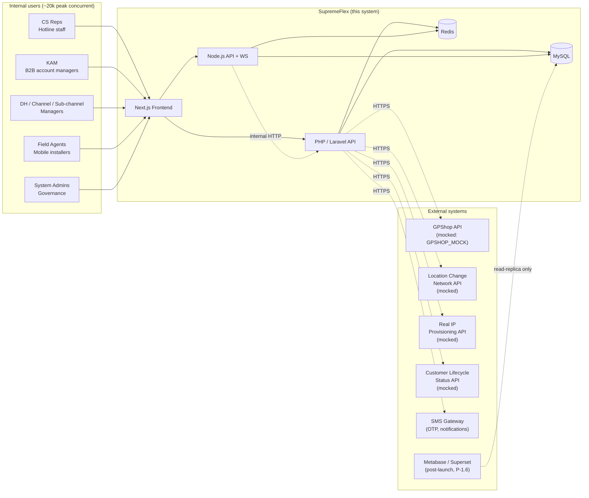

**Key constraints:**
- This CRM serves **internal GP staff only**. No public-customer surface.
- The full GP subscriber base is ~80M, but only **3–10M** of those are GPFI customers visible in this system over the 5-year horizon.
- All external integrations (GPShop, LocationChange, RealIP, CustomerLifecycle) are mocked-by-default; real-stub classes throw until env flag flipped (see `docs/SupremeFlex_Consolidated_Requirements.md` §7).

---

## 2. Container Diagram

### 2.1 Current state (pre Phase -1)

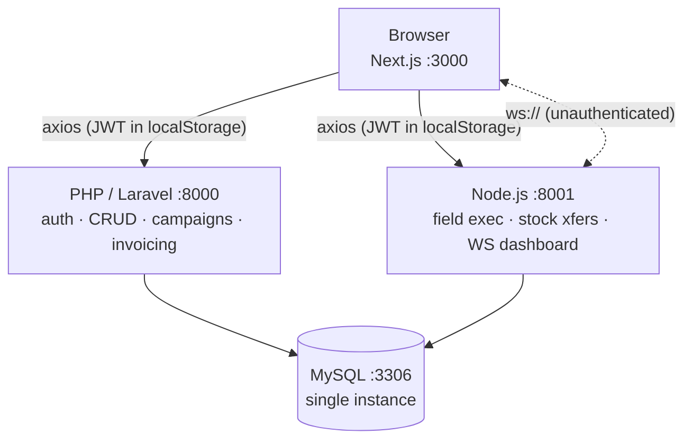

**Gaps in current state:**
- JWT in `localStorage` → XSS-vulnerable (closed by **P-1.2**)
- WebSocket has no auth check (closed by **P-1.2**)
- Single MySQL, no replicas, no cache, no queue (closed by **P-1.7**)
- No idempotency on retries (closed by **P-1.3**)
- `CHAR(36)` random UUIDv4 PKs → page splits at scale (closed by **P-1.1**)

### 2.2 Target state (post Phase -1)

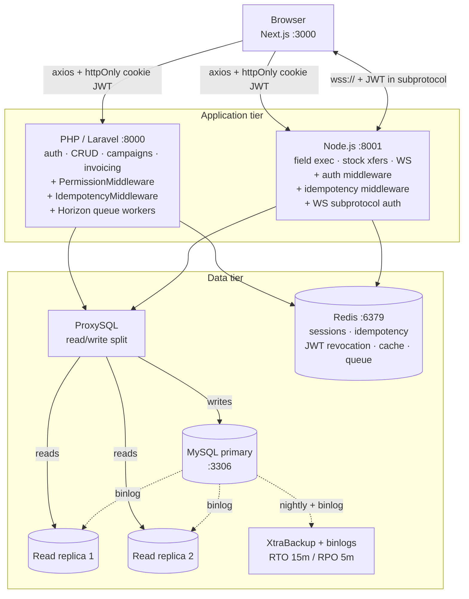

**Tagged Phase -1 changes:**
| Change | Closes |
|---|---|
| httpOnly cookies + refresh token + revocation | P-1.2 |
| WebSocket subprotocol auth | P-1.2 |
| `PermissionMiddleware` enforcing `has_role()` | P-1.2 |
| `IdempotencyMiddleware` | P-1.3 |
| MySQL replicas + ProxySQL | P-1.7 |
| Redis (sessions, idempotency, revocation, cache, queue) | P-1.7 |
| Horizon queue workers replacing daily Artisan crons | P-1.7 |
| Backup with documented RTO/RPO | P-1.7 |
| UUIDv7 / `BINARY(16)` PKs across all 39 tables | P-1.1 |

---

## 3. Component Diagrams

### 3.1 PHP / Laravel backend

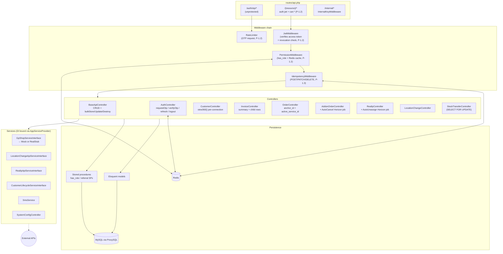

### 3.2 Node.js backend

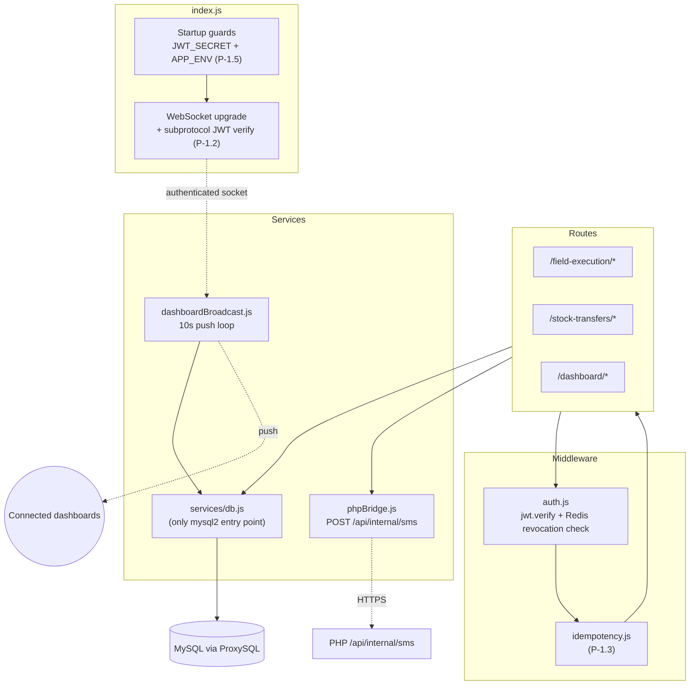

---

## 4. Key Sequence Flows

### 4.1 OTP login (target — post P-1.2)

```mermaid
sequenceDiagram
    actor U as User (CS rep, FA, etc.)
    participant FE as Next.js
    participant PHP as PHP /api/auth/otp/*
    participant RL as RateLimiter (P-1.2)
    participant DB as MySQL otp_codes
    participant SMS as SMS Gateway
    participant RD as Redis (revocation)

    U->>FE: enter mobile number
    FE->>PHP: POST /otp/request {msisdn}
    PHP->>RL: check 5/h/msisdn + 20/d/IP
    alt rate limit hit
        RL-->>PHP: 429
        PHP-->>FE: 429 Too Many Requests
    end
    PHP->>DB: INSERT otp_codes (SHA-256 + salt, exp = NOW()+5min)
    PHP->>SMS: send(msisdn, OTP code)
    Note over PHP: dev: /api/auth/otp/dev-peek<br/>(only when APP_ENV != production)
    PHP-->>FE: 200 {requestId}

    U->>FE: enter OTP code
    FE->>PHP: POST /otp/verify {requestId, code}
    PHP->>DB: SELECT otp_codes WHERE id = ? AND attempts < 5
    alt code mismatch
        PHP->>DB: UPDATE attempts = attempts + 1
        alt attempts >= 5
            PHP-->>FE: 423 Locked (15min)
        else
            PHP-->>FE: 401 Invalid
        end
    end
    PHP->>PHP: generate access JWT (15m) + refresh JWT (7d)
    PHP->>RD: SET jti:{access_jti} = active (TTL 15m)
    PHP-->>FE: 200 + Set-Cookie: sf_access=...; HttpOnly; Secure; SameSite=Strict<br/>+ Set-Cookie: sf_refresh=...; HttpOnly; Secure; SameSite=Strict
    FE->>U: redirect to /dashboard
```

### 4.2 Order creation with idempotency (post P-1.3)

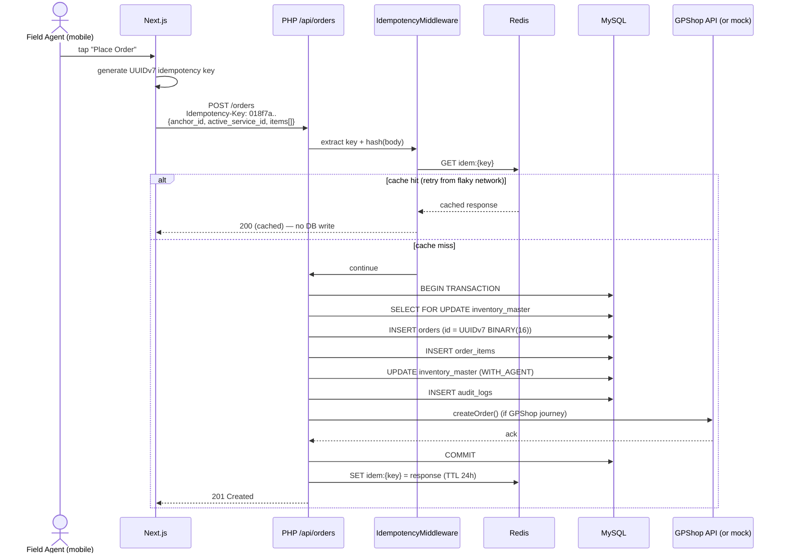

### 4.3 WebSocket dashboard (post P-1.2)

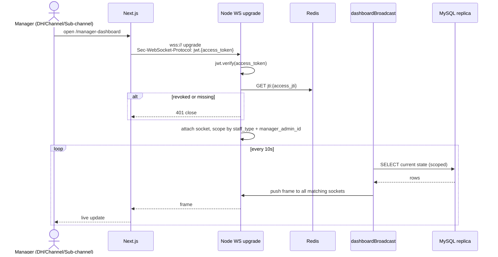

---

## 5. Data Architecture

### 5.1 Domain map

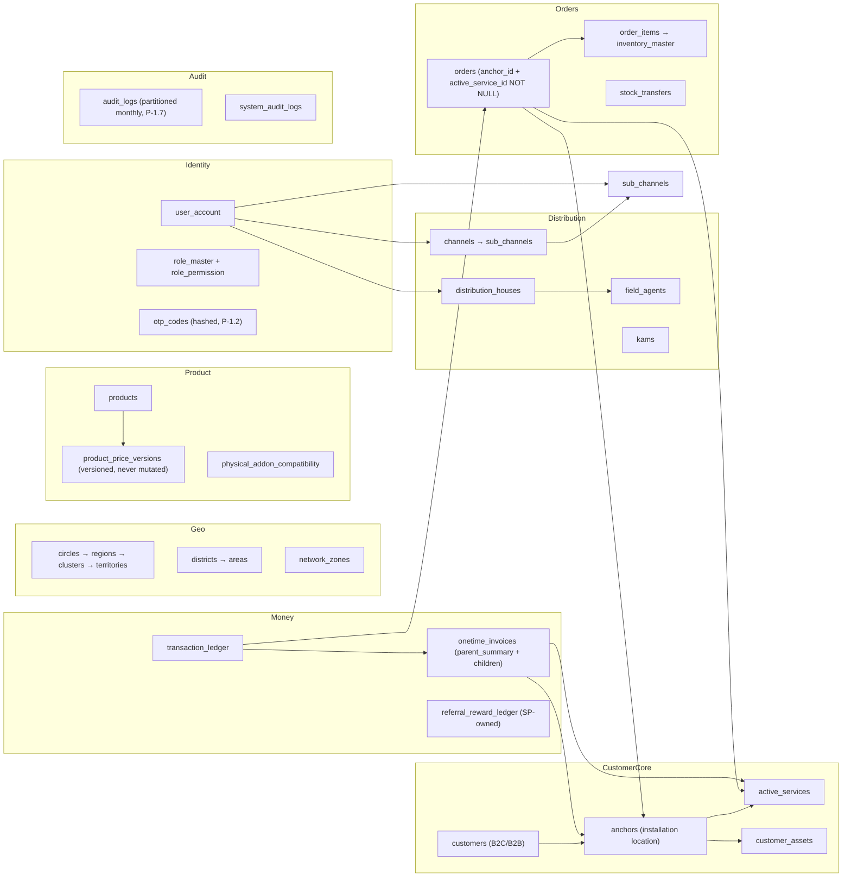

### 5.2 PK strategy (Phase -1 / P-1.1)

| Aspect | Current | Target |
|---|---|---|
| Type | `CHAR(36)` | `BINARY(16)` |
| Generation | `DEFAULT (UUID())` (random v4) | `Ramsey\Uuid::uuid7()` / `uuidv7` npm (time-ordered v7) |
| Size on disk | 36 bytes | 16 bytes |
| Index bloat (relative) | 4–5× | baseline |
| InnoDB page-split rate | High (random insertion) | <2% (time-ordered) |
| Storage in code | string | string at API boundary, `BINARY(16)` in queries |

### 5.3 Read/write routing (Phase -1 / P-1.7)

| Workload | Route to |
|---|---|
| Order writes, stock transfers, invoice writes | **Primary** |
| Customer 360 reads, dashboards, reports | **Read replica** |
| Audit log writes | Primary |
| Audit log reads | Replica |
| OTP `otp_codes` writes/reads | Primary (low latency required) |

ProxySQL rule: `SELECT` → replica unless `FOR UPDATE` / `INSERT` / `UPDATE` / `DELETE` / explicit `/* primary */` hint.

### 5.4 Partitioning (Phase -1 / P-1.7)

| Table | Strategy | Retention |
|---|---|---|
| `audit_logs` | RANGE by month on `created_at` | 24 months online; archive to cold storage |
| `system_audit_logs` | RANGE by month on `created_at` | 12 months |
| `transaction_ledger` | RANGE by quarter on `transaction_date` | indefinite; archive after 5 years |
| `otp_codes` | RANGE by week on `created_at` | 7 days; pruned weekly |

---

## 6. Security Architecture

### 6.1 Trust boundaries

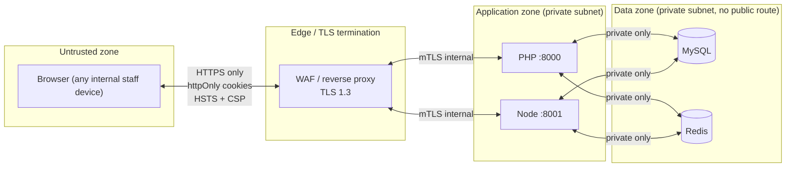

### 6.2 Auth & RBAC chain (Phase -1 / P-1.2)

Every protected request passes through:

1. **TLS termination** at WAF
2. **JwtMiddleware** — verifies signature + expiry, checks Redis revocation by `jti`
3. **PermissionMiddleware** — calls `has_role(user.id, required_role)` SP, caches result in Redis 300s
4. **IdempotencyMiddleware** — for mutating verbs, dedupes by `Idempotency-Key`
5. Controller / route handler

If any step fails: 401 / 403 / 423 / 429 as appropriate — never silent fall-through.

### 6.3 Secret management

| Secret | Storage | Rotation |
|---|---|---|
| JWT signing key | KMS / Vault (target) | Every 90 days |
| Redis password | KMS / Vault | Every 90 days |
| MySQL credentials | KMS / Vault per role (RW vs RO) | Every 90 days |
| SMS gateway API key | KMS / Vault | Provider policy |
| External API keys (GPShop, LocationChange, RealIP) | KMS / Vault | Provider policy |

`.env` files are dev-only. Production secrets injected at process start.

### 6.4 PII handling

- **In transit:** TLS 1.3 everywhere; mTLS between internal services
- **At rest:** MySQL transparent data encryption on backups (XtraBackup `--encrypt`); Redis with TLS + auth
- **In logs:** OTP, JWT, NID, and full MSISDN must be redacted before write (regex middleware on log writer)
- **PII columns:** `customers.nid`, `customers.contact_number`, `user_account.contact_number` — column-level access controls; only specific roles can SELECT raw values via stored procedures
- **Right-to-erasure:** documented as post-launch compliance work; out of Phase -1 scope

---

## 7. Scale & Performance

### 7.1 Target capacity

| Dimension | 5-year target |
|---|---|
| GPFI customer records | 3–10M |
| `active_services` rows | 5–20M (some customers have multiple) |
| `orders` rows | 50M+ |
| `transaction_ledger` rows | low hundreds of millions |
| `audit_logs` rows | low billions (mitigated by partition + archive) |
| Concurrent internal users | 20k peak |
| Orders/day peak | ~50k |
| WS dashboard concurrent | up to 2k managers |

### 7.2 Hot paths and mitigations

| Path | Hot data | Mitigation |
|---|---|---|
| Customer 360 lookup | Customer + anchors + active_services + addons + cpe + ott + loc history + real IP | Redis read-through cache 60s TTL; replica read |
| Product catalog read | products + price_versions (CURRENT) | Redis cache, invalidate on price version add |
| RBAC check | `has_role()` result | Redis per-user 300s |
| Geography hierarchy | circles → … → areas | Redis cache 24h, invalidate on master-data update |
| Dashboard WS push | scoped state per manager | Replica read; broadcast every 10s only when delta detected |

### 7.3 Queue (Phase -1 / P-1.7)

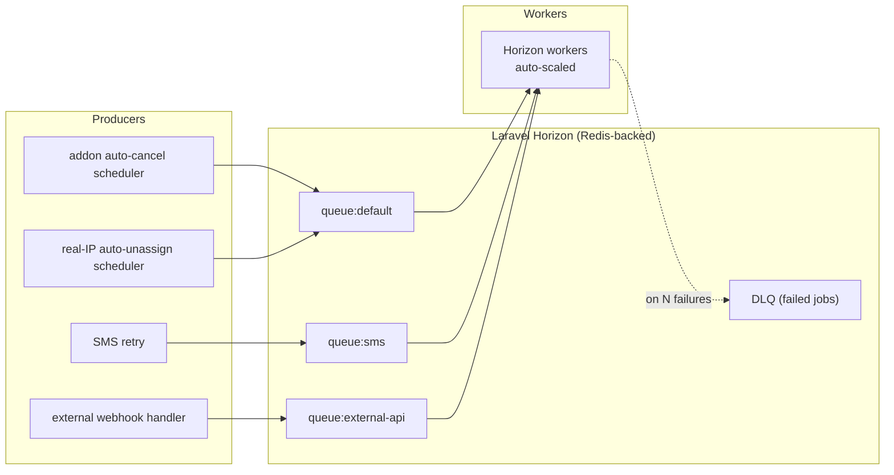

Replaces the daily Artisan crons referenced in `docs/plan.md` Phase 2.

---

## 8. External Integrations

| System | Direction | Protocol | Service class | Env flag | Default |
|---|---|---|---|---|---|
| GPShop | PHP → external | HTTPS REST | `GpShopService` (mock) / `GpShopApiService` (real stub) | `GPSHOP_MOCK` | mock |
| Location Change | PHP → external | HTTPS REST | `LocationChangeApiService` / `LocationChangeApiRealService` | `LOCATION_CHANGE_API_MOCK` | mock |
| Real IP provisioning | PHP → external | HTTPS REST | `RealIpApiService` / `RealIpApiRealService` | `REAL_IP_API_MOCK` | mock |
| Customer Lifecycle | PHP → external | HTTPS REST | `CustomerLifecycleService` / `CustomerLifecycleApiService` | `CUSTOMER_LIFECYCLE_MOCK` | mock |
| SMS gateway | PHP → external | HTTPS REST | `SmsService` | (gateway URL in env) | n/a |
| Node ↔ PHP | Node → PHP internal | HTTPS REST | `phpBridge.js` → `InternalController` (guarded by `InternalKeyMiddleware`) | n/a | always real |
| Reporting (Metabase) | external read-only | MySQL replica | n/a | n/a | post-launch |

**Resilience pattern (target):** every external call wrapped in a circuit breaker; failures emit to queue with retry budget; status visible in Horizon dashboard.

---

## 9. Observability (target)

| Concern | Tool |
|---|---|
| Metrics | Prometheus + Grafana |
| Logs | Loki (or ELK) — structured JSON with trace_id, redacted PII |
| Tracing | OpenTelemetry → Jaeger or Tempo |
| Alerting | Alertmanager → on-call rotation (PagerDuty / OpsGenie) |
| Queue health | Laravel Horizon dashboard |
| Slow queries | MySQL slow log + pt-query-digest weekly |
| RBAC / auth audit | `audit_logs` table + log shipping |

**SLOs (target, draft):**
- API p95 latency: 300 ms
- API error rate: < 0.1 %
- WS message delivery: < 2 s
- Order write success: ≥ 99.9 %

---

## 10. Deployment Topology

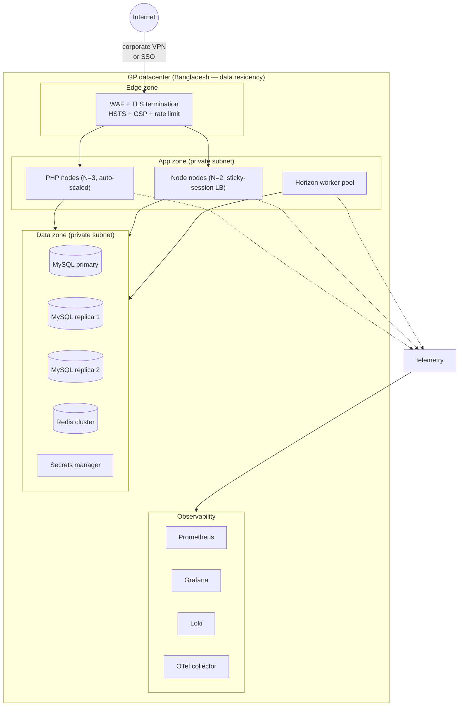

**Notes:**
- Data residency in Bangladesh per BTRC expectations (subject to legal review — see `docs/SupremeFlex_Consolidated_Requirements.md` §11.6)
- Sticky sessions on Node LB required for WS dashboard until Redis pub/sub fan-out is added (phase 2 of P-1.7)
- Horizon worker pool sized independently from API pool

---

## 11. Architecture Decision Log

| # | Decision | Rationale | Phase |
|---|---|---|---|
| ADR-001 | Two-backend split (PHP CRUD vs Node field/WS) | PHP team familiarity; Node for WS/streaming; clear domain boundaries | Existing |
| ADR-002 | Single MySQL for both backends | Simplicity at current scale; revisit if Node domains diverge | Existing — to revisit post Phase -1 |
| ADR-003 | UUIDv7 / `BINARY(16)` PKs replace `CHAR(36) UUID()` | Time-ordered insertion → no page splits; 4–5× smaller indexes; better joins | Phase -1 / P-1.1 |
| ADR-004 | JWT in httpOnly cookies, not localStorage | localStorage is XSS-stealable; cookie with SameSite=Strict + CSRF is industry standard | Phase -1 / P-1.2 |
| ADR-005 | Access (15m) + refresh (7d) + revocation list | Short access tokens contain blast radius; revocation enables immediate de-provision | Phase -1 / P-1.2 |
| ADR-006 | `Idempotency-Key` header required on mutating endpoints | Mobile retries must not duplicate orders / IP assignments / stock transfers | Phase -1 / P-1.3 |
| ADR-007 | Drupal removed from architecture | `/drupal/` is empty; CVE / patch cost not justified for "configurable texts" | Phase -1 / P-1.6 |
| ADR-008 | Reporting via Metabase post-launch (not Drupal) | Read-only BI behind SSO + read replica; minimal new attack surface | Post-launch |
| ADR-009 | Laravel Horizon (Redis queue) replaces daily Artisan crons | Daily crons saturate at scale; queue enables retry/DLQ/observability | Phase -1 / P-1.7 |
| ADR-010 | Monthly RANGE partitioning on `audit_logs`, `transaction_ledger`, `otp_codes` | Bounded table scan; trivial archival; predictable backup size | Phase -1 / P-1.7 |
| ADR-011 | `has_role()` SP remains DB-side; result cached 300s in Redis | Keeps RBAC source-of-truth in DB; cache absorbs the latency cost | Phase -1 / P-1.2 |
| ADR-012 | WebSocket auth via JWT in subprotocol (not query string) | Query strings get logged; subprotocol is the standards-conformant location | Phase -1 / P-1.2 |
| ADR-013 | All four external APIs ship as mock + real-stub behind interface | Toggleable via env; production guard prevents accidental mock | Existing (P0 / E0) — hardened by P-1.5 |

---

## 12. Open Architecture Questions

These need decisions before BLOCK A begins:

1. **WAF choice** — Cloudflare, AWS WAF, on-prem (modsecurity)? Affects edge security posture.
2. **Reporting DB user permissions** — Read-only on which schemas / which tables? Affects Metabase rollout.
3. **Horizon vs Sidekiq-style alternatives** — Confirm Horizon meets ops needs; alternative is a separate Node-based queue.
4. **MySQL flavor** — Vanilla MySQL 8.0, Percona, or MariaDB? Affects backup tooling and ProxySQL behavior.
5. **mTLS internally** — Required from day 1, or first deploy without and add later?
6. **Multi-region** — Post-launch; do we plan for Bangladesh-only or BD + DR region?

Each question deserves an ADR before Phase -1 deployment work begins.

---

**Maintenance:** Update this document whenever architecture changes (component added/removed, topology revised, ADR added). Treat as code: PR review required for changes to §1–§10. §11 (ADRs) is append-only.
